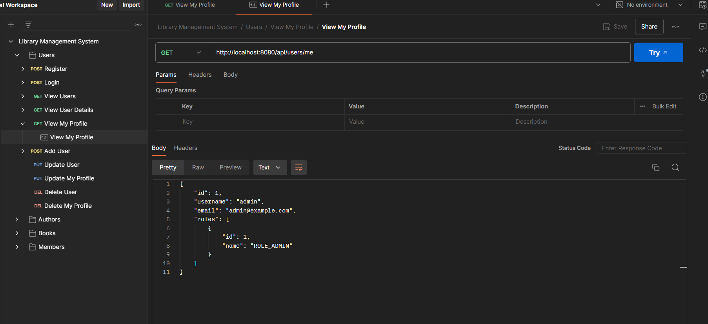
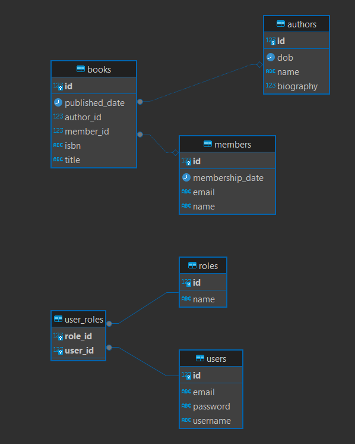
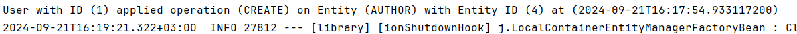
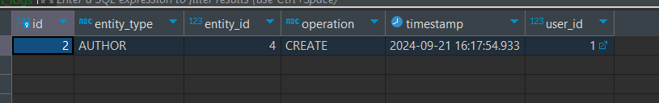

# Library Management System


## Overview

This project is a Spring Boot application designed to manage library system. It provides a set of RESTful APIs for functionalities such as user authentication, author management, book management, member management. The application uses modern technologies and practices to ensure security, scalability, and maintainability.

## Table of Contents

- [Features](#features)
- [Technologies Used](#technologies-used)
- [Setup Instructions](#setup-instructions)
- [ERD](#ERD)
- [API Endpoints](#api-endpoints)
- [Database Migration](#database-migration)
- [Security](#security)
- [Postman Documentation](#postman)
- [Exception Handling](#exception-handling)
- [Audit Logging] (#audit-logging)

## Features

- **Authentication Management**: Login and Signup functionality.
- **Authorization Management**: APIs Authorization controlled by roles.
- **Book Management**: Create, read, update, and delete books management.
- **Author Management**: Create, read, update, and delete authors management.
- **Member Management**: Create, read, update, and delete members management.
- **User Management**: Create, read, update, and delete users management.
- **Database**: Oracle database for data storage with Flyway for migrations.
- **Security**: JWT token-based authentication and authorization with hashed passwords.
- **Exception Handling**: Global exception handling using Controller Advice.
- **Audit Logging**: Added Audit Logging for tracing

## Technologies Used

- **Java 17**
- **Spring Boot**
- **Maven**
- **Hibernate ORM**
- **Flyway**
- **Docker**
    - Postgresql Database
- **JWT (JSON Web Tokens)**
- **Postman**

## Setup Instructions

### Prerequisites

- Docker and Docker Compose
- Java 17
- Maven

### Steps

1. **Run Docker Compose**: This will start the Postgresql Database container.
   ```sh
   docker-compose up
   ```

2. **Run the Spring Boot Application**: Use Maven to build and run the application.
   ```sh
   mvn spring-boot:run
   ```

3. **Test the APIs**: Use the provided Postman collection to test the APIs.

## Postman
You can find the project's postman collection in `src/main/resources/postman` and inside each API example for happy flow scenario



## ERD



## API Endpoints

### Public Endpoints (No Authentication Required)

#### Users
- **Register**: `POST /api/users/register`  
  Allows anyone to create a new user account.

- **Login**: `POST /api/users/login`  
  Allows registered users to authenticate and receive a JWT token.

### Protected Endpoints

#### For Regular Authenticated Users (ROLE_USER)

##### Books
- **View All Books**: `GET /api/books`  
  View the list of all books.

- **View Book Details**: `GET /api/books/{id}`  
  View details of a specific book by its ID.

##### Authors
- **View All Authors**: `GET /api/authors`  
  View the list of all authors.

- **View Author Details**: `GET /api/authors/{id}`  
  View details of a specific author by their ID.

##### Members
- **View All Members**: `GET /api/members`  
  View the list of all members.

- **View Member Details**: `GET /api/members/{id}`  
  View details of a specific member by their ID.

##### User Profile
- **View My Profile**: `GET /api/users/me`  
  View your own profile details.

- **Update My Profile**: `PUT /api/users/me`  
  Update your own profile details (e.g., username, password).

- **Delete My Profile**: `DELETE /api/users/me`  
  Delete your own account.

#### For Admin Users (ROLE_ADMIN)

##### Books
- **View All Books**: `GET /api/books`  
  View the list of all books.

- **View Book Details**: `GET /api/books/{id}`  
  View details of a specific book by its ID.

- **Create Book**: `POST /api/books`  
  Create a new book.

- **Update Book**: `PUT /api/books/{id}`  
  Update an existing book.

- **Delete Book**: `DELETE /api/books/{id}`  
  Delete a book.

##### Authors
- **View All Authors**: `GET /api/authors`  
  View the list of all authors.

- **View Author Details**: `GET /api/authors/{id}`  
  View details of a specific author by their ID.

- **Create Author**: `POST /api/authors`  
  Create a new author.

- **Update Author**: `PUT /api/authors/{id}`  
  Update an existing author.

- **Delete Author**: `DELETE /api/authors/{id}`  
  Delete an author.

##### Members
- **View All Members**: `GET /api/members`  
  View the list of all members.

- **View Member Details**: `GET /api/members/{id}`  
  View details of a specific member by their ID.

- **Create Member**: `POST /api/members`  
  Create a new member.

- **Update Member**: `PUT /api/members/{id}`  
  Update an existing member.

- **Delete Member**: `DELETE /api/members/{id}`  
  Delete a member.

##### User Management
- **View All Users**: `GET /api/users`  
  View the list of all users.

- **View User Details**: `GET /api/users/{id}`  
  View details of a specific user by their ID.

- **Update User**: `PUT /api/users/{id}`  
  Update details of any user (e.g., assign roles, update email).

- **Delete User**: `DELETE /api/users/{id}`  
  Delete any user.

- **Create User**: `POST /api/users`  
  Create new users with specified roles (ROLE_USER or ROLE_ADMIN).


## Database Migration

Flyway is used to manage database migrations. SQL files are located in the `src/main/resources/db/migration` directory. Migrations are automatically applied when the application starts.

## Security

- **JWT Tokens**: Used for authentication and authorization. Each token expires after 1 hour.
- **Password Hashing**: Secure hashing techniques are used to store passwords.


## Audit Logging

Added Audit Logging to enable tracing user behavior in the system





## Exception Handling

Global exception handling is implemented using Controller Advice to provide consistent error responses.
